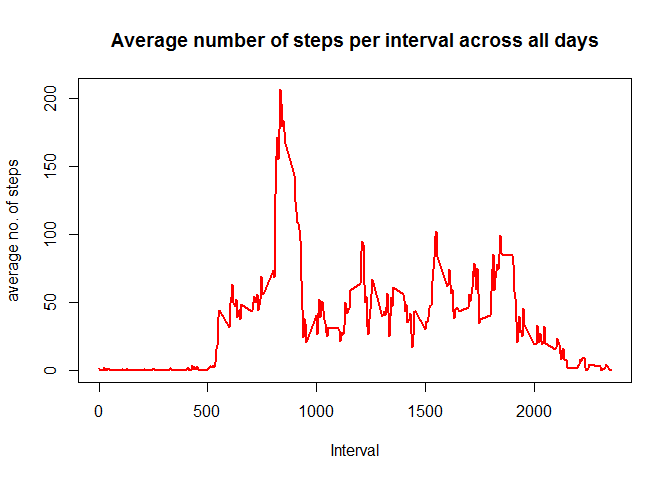
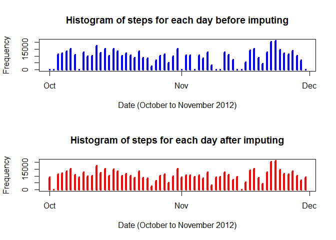
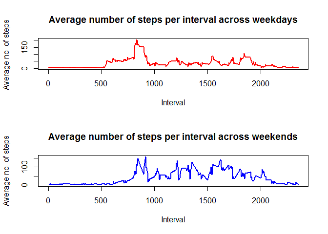

# Reproducible Research:Project1


##Loading and Preprocessing the data
###Loading the data


```r
df<-read.csv("activity.csv",header=TRUE)
```
###Preprocessing the data

```r
#Converting variable date into appropriate date class variable
dates <- strptime(df$date, "%Y-%m-%d")
df$date <- dates
#Removing all the duplicate days and intervals
uniqDates <- unique(dates)
uniqIntervals <- unique(df$interval)
```
## What is mean total number of steps taken per day

### 1. Calculate the total number of steps per day

```r
#First Creating a data frame for steps by day. 
stepsday <- split(df$steps, dates$yday)
#Then calculating the total number of steps per day.
totalstepsday <- sapply(stepsday, sum, na.rm=TRUE)
totalstepsday 
```

```
##   274   275   276   277   278   279   280   281   282   283   284   285 
##     0   126 11352 12116 13294 15420 11015     0 12811  9900 10304 17382 
##   286   287   288   289   290   291   292   293   294   295   296   297 
## 12426 15098 10139 15084 13452 10056 11829 10395  8821 13460  8918  8355 
##   298   299   300   301   302   303   304   305   306   307   308   309 
##  2492  6778 10119 11458  5018  9819 15414     0 10600 10571     0 10439 
##   310   311   312   313   314   315   316   317   318   319   320   321 
##  8334 12883  3219     0     0 12608 10765  7336     0    41  5441 14339 
##   322   323   324   325   326   327   328   329   330   331   332   333 
## 15110  8841  4472 12787 20427 21194 14478 11834 11162 13646 10183  7047 
##   334 
##     0
```
###2.Create a histogram of the total number of steps taken each day

```r
# Plotting a histogram where the x-axis denotes the day and the y-axis denotes the total number of steps taken for each day

plot(uniqDates, totalstepsday, main="Histogram of total steps taken on each day", xlab="Date", ylab="Frequency", type="h", lwd=6, col="red")
```

<!-- -->

###3.Calculate and report the mean and median of the total number of steps taken per day
### Mean 

```r
#Calculating mean steps per day
mean(totalstepsday,na.rm = TRUE)
```

```
## [1] 9354.23
```
###Median

```r
####Calculating median steps per day 
median(totalstepsday)
```

```
## [1] 10395
```
##What is the average daily activity pattern? 
### 1. Make a time series plot (i.e. type = "l") of the 5-minute interval (x-axis) and the average number of steps taken, averaged across all days (y-axis)


```r
#### First creating data frame for steps by interval. Then calculating the average number of steps per interval. Then plot the time-series graph.
stepsinterval <- split(df$steps, df$interval)
averageStepsInterval <- sapply(stepsinterval, mean, na.rm=TRUE)
plot(uniqIntervals, averageStepsInterval, type="l",
     main="Average number of steps per interval across all days", 
     xlab="Interval", ylab="average no. of steps", 
     lwd=2, col="red")
```

<!-- -->

###2. Which 5-minute interval, on average across all the days in the dataset, contains the maximum number of steps?

#### The interval which contains the maximum number of steps is


```r
maxIntervalDays <- max(averageStepsInterval, na.rm=TRUE)
maxIndex <- as.numeric(which(averageStepsInterval == maxIntervalDays))
maxInterval <- uniqIntervals[maxIndex]
#abline(v=maxInterval, col="blue", lwd=3)
maxInterval
```

```
## [1] 835
```

##Imputing missing values
###1. Calculate and report the total number of missing values in the dataset (i.e. the total number of rows with NAs)
####The total number of missing values in the dataset is

```r
#### Calculating the total number of missing values in the dataset
isna<- is.na(df$steps)
sum(isna)
```

```
## [1] 2304
```

###2.Devise a strategy for filling in all of the missing values in the dataset. The strategy does not need to be sophisticated. For example, you could use the mean/median for that day, or the mean for that 5-minute interval, etc.


```r
#First replacing NaN values with 0
meanStepsDay[is.nan(meanStepsDay)] <- 0
# Now create a replicated vector 288 times as there are 288 intervals per day
meanColumn <- rep(meanStepsDay, 288)
# The variable steps before replacing with 0
baseSteps <- df$steps
# Find the NA values in the base steps data
stepsNA <- is.na(baseSteps)
# Replacing the NA steps with their corresponding mean
baseSteps[stepsNA] <- meanColumn[stepsNA]
```

### 3.Create a new dataset that is equal to the original dataset but with the missing data filled in.

```r
dfNew <- df
dfNew$steps <- baseSteps
#dfNew
# Split the new data frame for steps by day
stepsSplitNew <- split(dfNew$steps, dates$yday)
# Calculating the total number of steps over each day
# There would be no NA values
totalStepsDayNew <- sapply(stepsSplitNew, sum)
#head(totalStepsDayNew,30)
#is.na(totalStepsDayNew)
```

###4.Make a histogram of the total number of steps taken each day and Calculate and report the mean and median total number of steps taken per day. Do these values differ from the estimates from the first part of the assignment? What is the impact of imputing missing data on the estimates of the total daily number of steps?


```r
par(mfcol=c(2,1))
# Plotting the histogram on original data
plot(uniqDates, totalstepsday, main="Histogram of steps for each day before imputing", 
     xlab="Date (October to November 2012)", ylab="Frequency", type="h", lwd=4, col="blue")
# Plotting the histogram on imputed data
plot(uniqDates, totalStepsDayNew, main="Histogram of steps for each day after imputing", 
     xlab="Date (October to November 2012)", ylab="Frequency", type="h", lwd=4, col="red")
```

<!-- -->

###The mean of over all days for imputed data is

```r
mean(totalStepsDayNew)
```

```
## [1] 10579.21
```

```r
###The median of over all days for imputed data is
```

```
## [1] 10395
```
### Difference in Means of original and imputed data is

```r
diffMean=mean(totalstepsday,na.rm = TRUE)-mean(totalStepsDayNew)
diffMean
```

```
## [1] -1224.979
```
### Difference in Medians of original and imputed data is

```r
diffMedian=median(totalstepsday)-median(totalStepsDayNew)
diffMedian
```

```
## [1] 0
```
###The mean value of origial data (9354.23) is lower than the mean value of the imputed data (10579.21). However, there is no difference in the median values of original and imputed data. So the average total daily number of steps increased by imputing the missing observations.

##Are there differences in activity patterns between weekdays and weekends?
### 1.Create a new factor variable in the dataset with two levels :weekdayây and weekendây indicating whether a given date is a weekday or weekend day.


```r
# Creating two data frames one for weekday and another for weekend from the new dataset
# The dates is a POSIXlt class and wday is part of this class
# wday takes values from 0 to 6 that represents the day of the week
# 0 is for Sunday, 1 is for Monday, going up to 6 for Saturday
weekdays <- dates$wday
# Creating a factor variable that classifies the day as either a weekday or weekend
# Create a numeric vector with 2 levels - 1 is for a weekday, 2 for a weekend
fweekday <- rep(0, length(weekdays)-1)
fweekday[weekdays >= 1 & weekdays <= 5] <- 1
fweekday[weekdays == 6 | weekdays == 0] <- 2
# Create a new factor variable with labels Weekdays and Weekends
fdays <- factor(fweekday, levels=c(1,2), labels=c("Weekdays", "Weekends"))
# Create a new column that contains this factor for each day
dfNew$typeDay <- fdays
# Now split up into two data frames
dfWeekdays <- dfNew[dfNew$typeDay == "Weekdays", ]
dfWeekends <- dfNew[dfNew$typeDay == "Weekends", ]
```
###2.Make a panel plot containing a time series plot (i.e. type = "l") of the 5-minute interval (x-axis) and the average number of steps taken, averaged across all weekday days or weekend days (y-axis). See the README file in the GitHub repository to see an example of what this plot should look like using simulated data


```r
#We have two data frames one for weekdays and one for weekends
#Split the weekdays data frame for steps by interval
#Split the weekends data frame for steps by interval
dfSplitWeekdays <- split(dfWeekdays$steps, dfWeekdays$interval)
dfSplitWeekends <- split(dfWeekends$steps, dfWeekends$interval)
# Find the average for each interval
meanStepsWeekdayInterval <- sapply(dfSplitWeekdays, mean)
meanStepsWeekendInterval <- sapply(dfSplitWeekends, mean)
par(mfcol=c(2,1))
plot(uniqIntervals, meanStepsWeekdayInterval, type="l",
main="Average number of steps per interval across weekdays", 
xlab="Interval", ylab="Average no. of steps ", 
lwd=2, col="red")
plot(uniqIntervals, meanStepsWeekendInterval, type="l",
main="Average number of steps per interval across weekends", 
xlab="Interval", ylab="Average no. of steps", 
lwd=2, col="blue")
```

<!-- -->

###The subject is more active earlier in the weekdays. But the subject is more active in the weekends than the weekdays.
